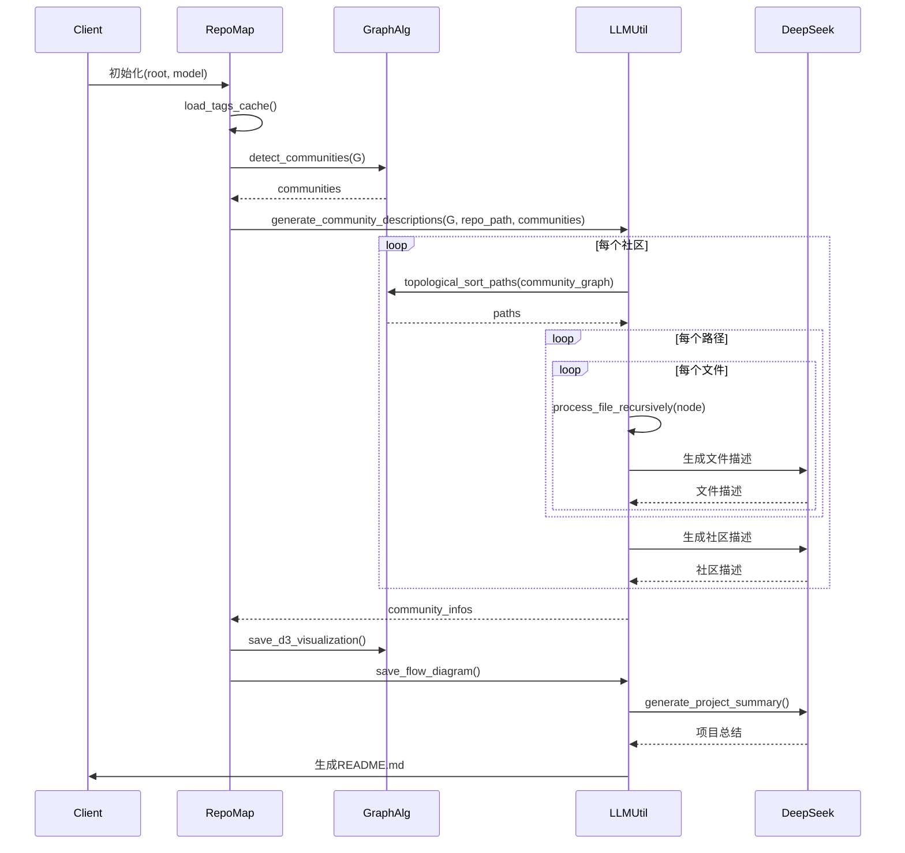

```mermaid
graph TD
    Start[开始分析项目] --> Tags[收集文件标签Tags]
    Tags --> BuildGraph[构建MultiDiGraph]
    BuildGraph --> AddDeps[添加节点和边]
    AddDeps --> Convert[转换为无向图]
    Convert --> Community[Louvain社区检测]
    Community --> CommInfo[整理社区信息]
    
    CommInfo --> CreateSubG[创建社区子图]
    CreateSubG --> TopoSort[获取拓扑排序]
    TopoSort --> ProcessFile[递归处理文件]
    ProcessFile --> FileDesc[生成文件描述]
    FileDesc --> CommDesc[生成社区描述]
    
    CommDesc --> D3Vis[生成D3.js交互图]
    D3Vis --> MermaidFlow[生成Mermaid流程图]
    MermaidFlow --> GenDoc[生成项目文档]

    subgraph "1. 构建依赖图"
        Tags
        BuildGraph
        AddDeps
    end

    subgraph "2. 社区检测"
        Convert
        Community
        CommInfo
    end

    subgraph "3. 生成描述"
        CreateSubG
        TopoSort
        ProcessFile
        FileDesc
        CommDesc
    end

    subgraph "4. 生成可视化"
        D3Vis
        MermaidFlow
        GenDoc
    end

    style Start fill:#e1f3d8,stroke:#82c91e,stroke-width:2px
    
    %% 为每个子图中的节点添加样式
    style Tags fill:#f9f7ed,stroke:#666,stroke-width:1px
    style BuildGraph fill:#f9f7ed,stroke:#666,stroke-width:1px
    style AddDeps fill:#f9f7ed,stroke:#666,stroke-width:1px
    
    style Convert fill:#f3e1e1,stroke:#666,stroke-width:1px
    style Community fill:#f3e1e1,stroke:#666,stroke-width:1px
    style CommInfo fill:#f3e1e1,stroke:#666,stroke-width:1px
    
    style CreateSubG fill:#e1f3f3,stroke:#666,stroke-width:1px
    style TopoSort fill:#e1f3f3,stroke:#666,stroke-width:1px
    style ProcessFile fill:#e1f3f3,stroke:#666,stroke-width:1px
    style FileDesc fill:#e1f3f3,stroke:#666,stroke-width:1px
    style CommDesc fill:#e1f3f3,stroke:#666,stroke-width:1px
    
    style D3Vis fill:#f3e1f3,stroke:#666,stroke-width:1px
    style MermaidFlow fill:#f3e1f3,stroke:#666,stroke-width:1px
    style GenDoc fill:#f3e1f3,stroke:#666,stroke-width:1px
```

```mermaid
sequenceDiagram
    participant Client
    participant RepoMap
    participant GraphAlg
    participant LLMUtil
    participant DeepSeek
    
    Client->>RepoMap: 初始化(root, model)
    RepoMap->>RepoMap: load_tags_cache()
    
    RepoMap->>GraphAlg: detect_communities(G)
    GraphAlg-->>RepoMap: communities
    
    RepoMap->>LLMUtil: generate_community_descriptions(G, repo_path, communities)
    
    loop 每个社区
        %% 先创建社区子图并获取拓扑排序路径
        LLMUtil->>GraphAlg: topological_sort_paths(community_graph)
        GraphAlg-->>LLMUtil: paths
        
        loop 每个路径
            loop 每个文件
                LLMUtil->>LLMUtil: process_file_recursively(node)
                LLMUtil->>DeepSeek: 生成文件描述
                DeepSeek-->>LLMUtil: 文件描述
            end
        end
        
        %% 收集所有文件描述后生成社区描述
        LLMUtil->>DeepSeek: 生成社区描述
        DeepSeek-->>LLMUtil: 社区描述
    end
    
    LLMUtil-->>RepoMap: community_infos
    
    RepoMap->>GraphAlg: save_d3_visualization()
    RepoMap->>LLMUtil: save_flow_diagram()
    
    LLMUtil->>DeepSeek: generate_project_summary()
    DeepSeek-->>LLMUtil: 项目总结
    
    LLMUtil->>Client: 生成README.md
```

