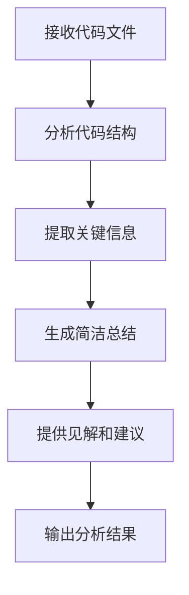
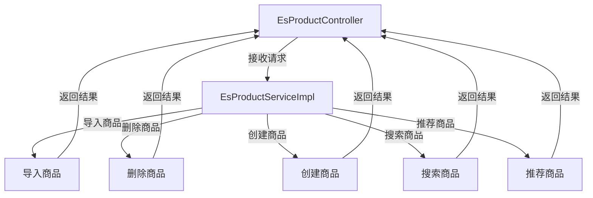
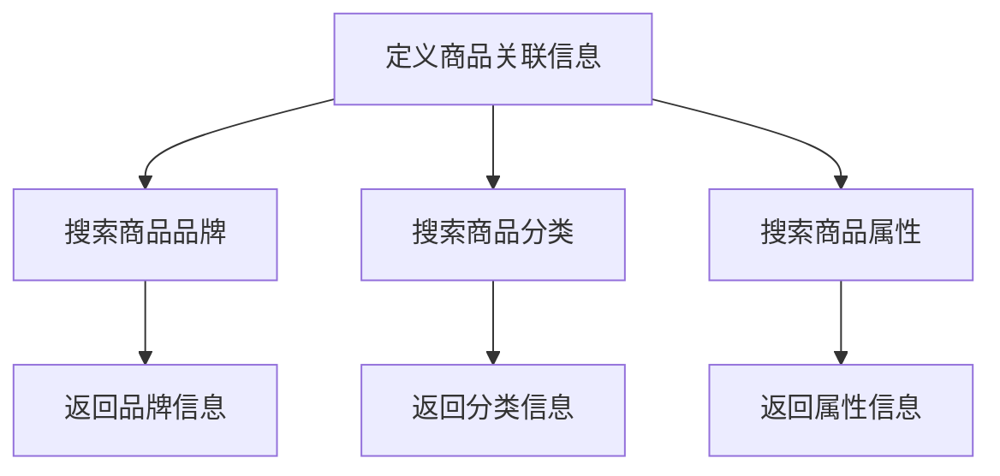
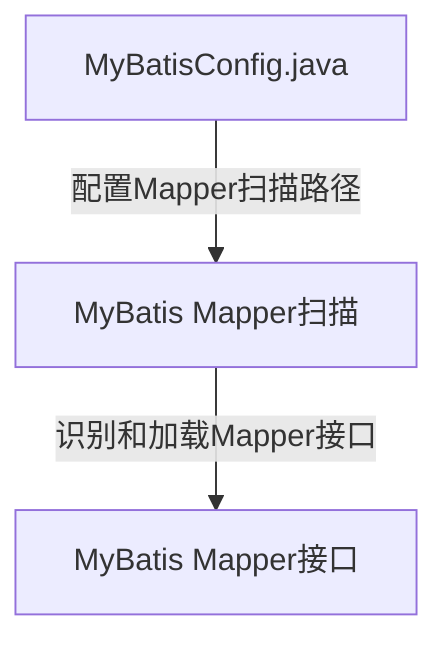

# mall-search

## 项目总结
该项目主要涉及代码分析和商品管理两大核心功能，旨在通过模块化的设计提升代码的可维护性和商品管理的效率。以下是各模块的主要用途及其协同工作方式：

1. **代码分析器**：该模块负责分析代码，生成简洁的总结和见解，帮助开发者更好地理解代码结构和逻辑，提升代码质量和可维护性。

2. **商品搜索管理**：此模块专注于商品的日常操作，包括商品的导入、删除、创建、搜索和推荐等功能。它确保商品数据能够被高效地管理和检索，提升用户体验。

3. **商品关联**：该模块用于定义和搜索商品的品牌、分类及属性信息，帮助系统更好地组织和展示商品信息，增强商品之间的关联性。

4. **Mapper扫描配置**：此模块负责配置MyBatis的Mapper扫描路径，确保MyBatis能够正确识别和加载Mapper接口，从而保证数据库操作的顺利进行。

**协同工作方式**：
- **代码分析器**为其他模块的代码提供分析和优化建议，确保整个项目的代码质量。
- **商品搜索管理**和**商品关联**模块共同协作，前者负责商品的基本操作，后者则提供商品的详细信息和关联关系，两者结合确保商品数据的完整性和可搜索性。
- **Mapper扫描配置**模块为商品管理模块提供数据库操作的底层支持，确保商品数据的持久化和检索效率。

通过这些模块的协同工作，项目实现了代码分析与商品管理的高效结合，提升了系统的整体性能和用户体验。

## 项目概览

[点击在浏览器中打开](repo_overview_with_communities.html)

## 主要模块
### 

### 代码分析器
用于分析代码并提供简洁的总结和见解。

### 商品搜索管理
该模块用于处理商品的导入、删除、创建、搜索和推荐等操作。

### 商品关联
此模块用于定义和搜索商品的品牌、分类及属性信息。

### Mapper扫描配置
此模块用于配置MyBatis的Mapper扫描路径，确保MyBatis能够正确识别和加载Mapper接口。

