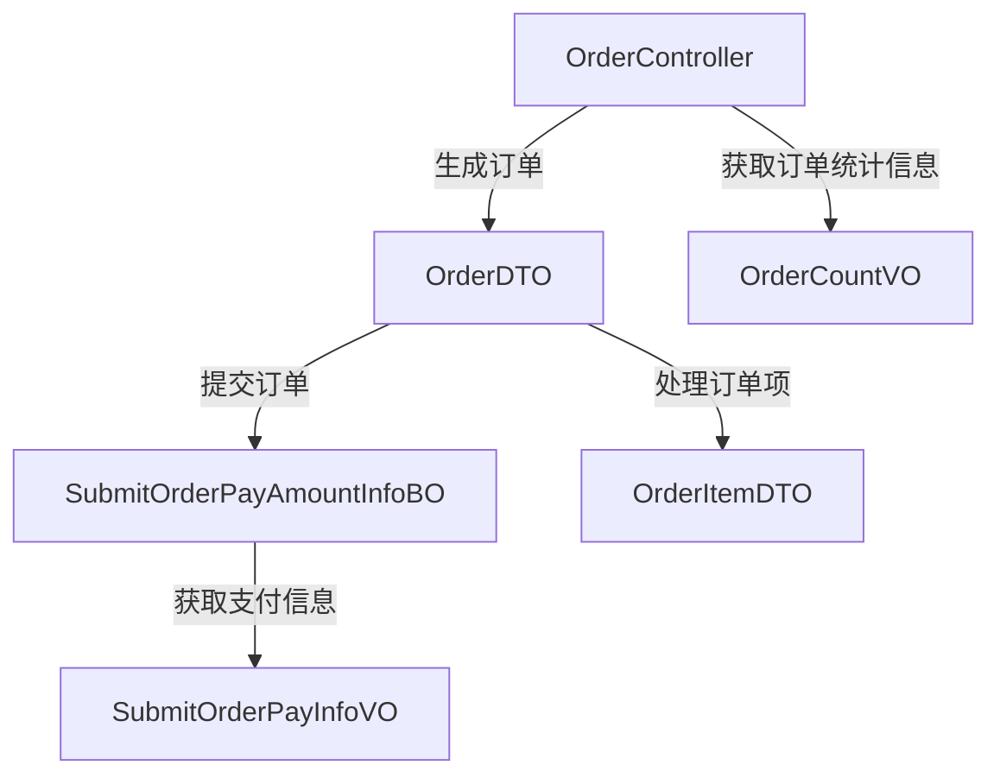
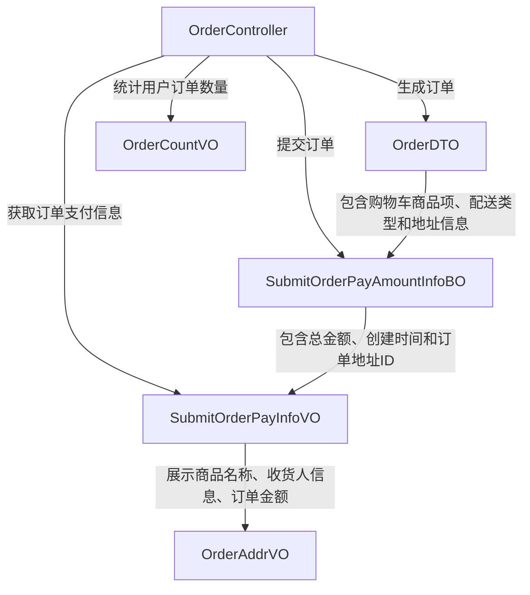
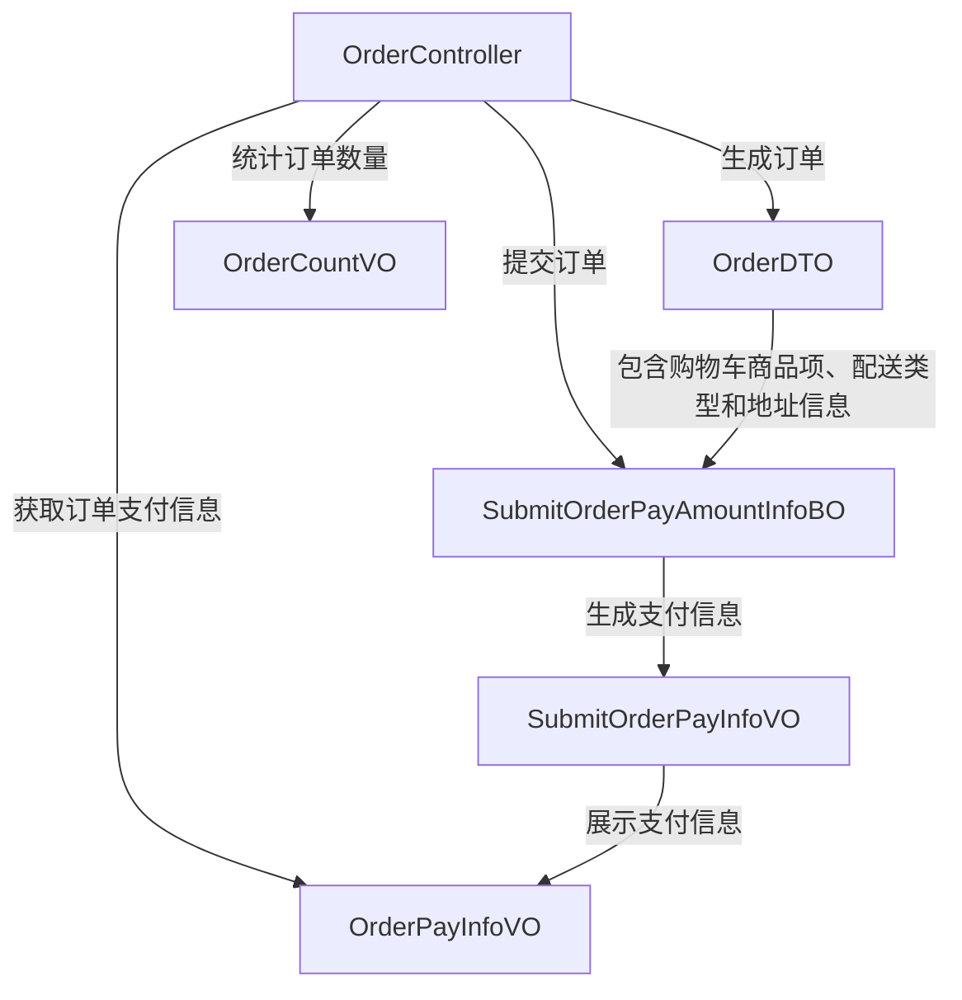
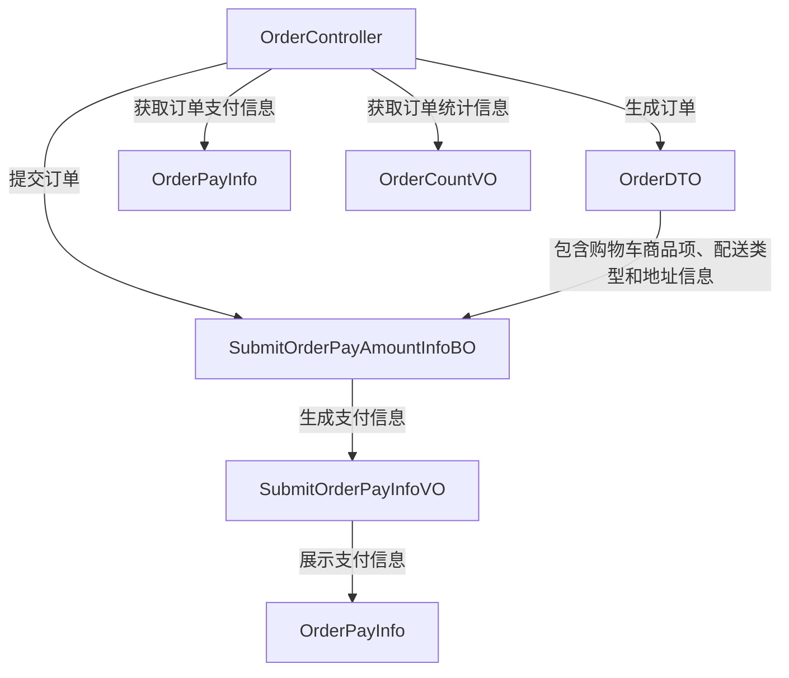
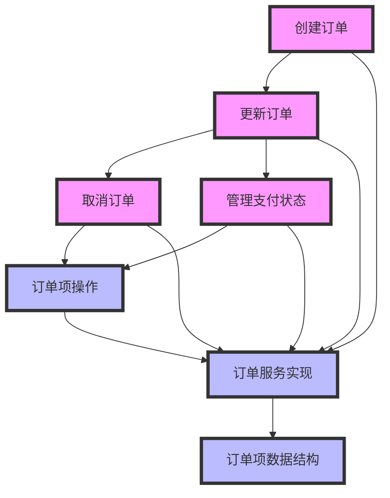
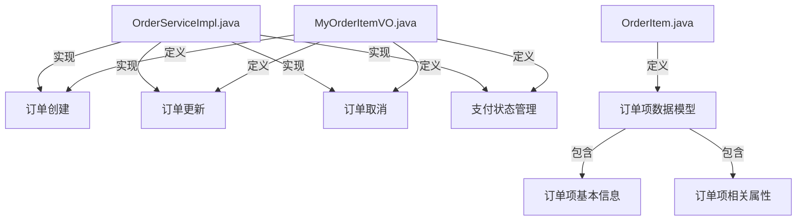
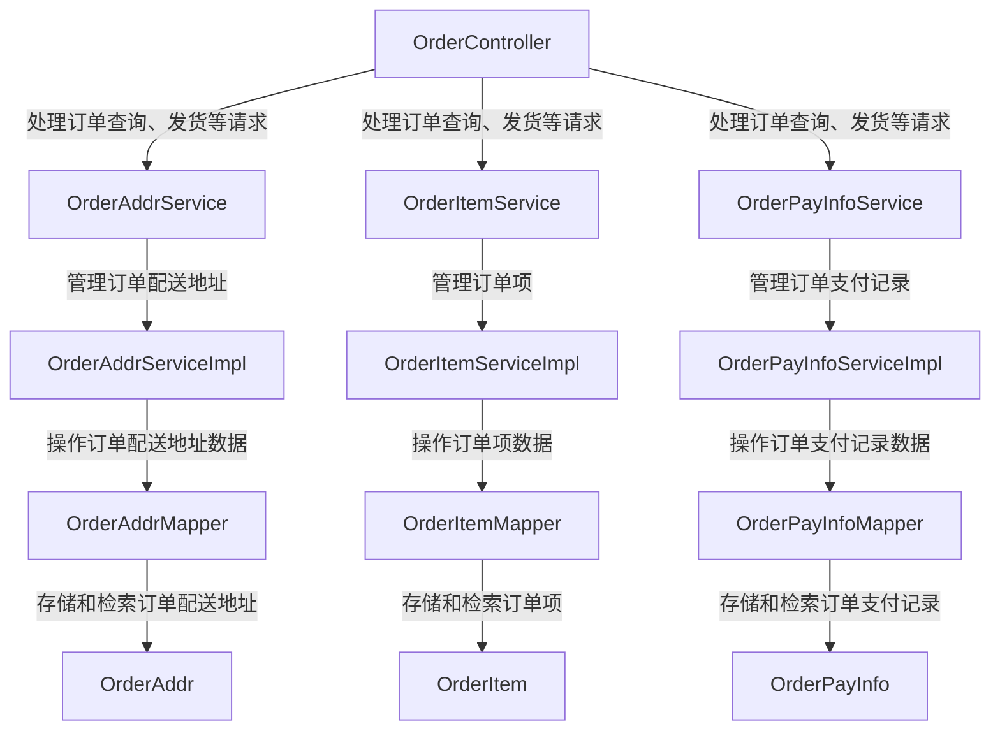

# mall4cloud-order

## 项目总结
**项目名称：mall4cloud-order**

**项目概述：**
mall4cloud-order 是一个专注于订单管理的模块，旨在处理订单的全生命周期操作，包括订单的生成、提交、支付、统计以及后续的更新、取消和状态管理。该模块通过集成多个核心功能，确保订单流程的顺畅和高效。

**主要用途：**
1. **订单生成与提交**：负责创建和提交订单，确保订单信息的准确性和完整性。
2. **支付管理**：处理订单的支付流程，包括支付记录的生成和支付状态的管理。
3. **订单更新与取消**：提供订单的更新和取消功能，确保订单状态的实时性和灵活性。
4. **订单统计**：对订单数据进行统计和分析，为业务决策提供支持。
5. **配送地址与订单项管理**：管理订单的配送地址和订单项，确保订单信息的详细和准确。
6. **数据库操作**：负责订单相关数据的存储和检索，确保数据的安全性和一致性。

**模块协同工作：**
- **订单生成与提交模块**：负责订单的初始创建和提交，将订单信息传递给支付管理模块。
- **支付管理模块**：处理订单的支付流程，更新支付状态，并将支付记录传递给订单统计模块。
- **订单更新与取消模块**：根据业务需求更新或取消订单，并将状态变化同步到其他相关模块。
- **订单统计模块**：收集和分析订单数据，生成统计报告，为业务决策提供数据支持。
- **配送地址与订单项管理模块**：管理订单的配送地址和订单项信息，确保订单信息的完整性和准确性。
- **数据库操作模块**：负责所有订单相关数据的存储和检索，确保数据的一致性和安全性。

通过各模块的协同工作，mall4cloud-order 实现了订单全生命周期的自动化管理，提高了订单处理的效率和准确性。

## 项目概览

[点击在浏览器中打开](repo_overview_with_communities.html)

## 主要模块
### 模块 0

### 订单管理
该模块用于处理订单的生成、提交、支付及统计等全流程操作。

### 订单管理
该模块用于处理订单的创建、更新、取消及支付状态管理等核心功能。

### 模块 2

### 订单管理
该模块用于处理订单的全生命周期操作，包括支付记录、配送地址、订单项的管理和数据库操作。

