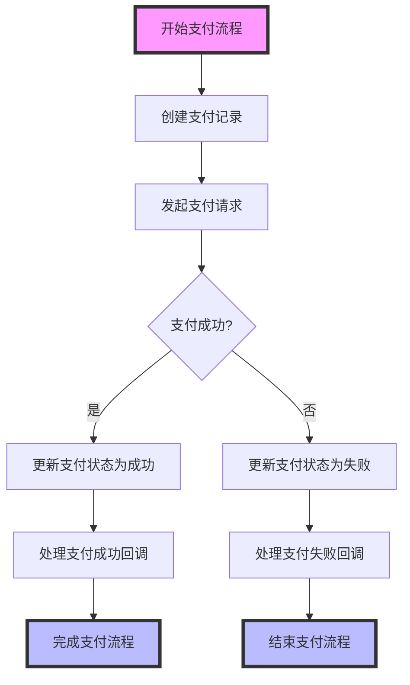
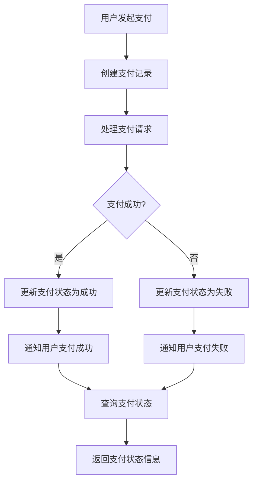
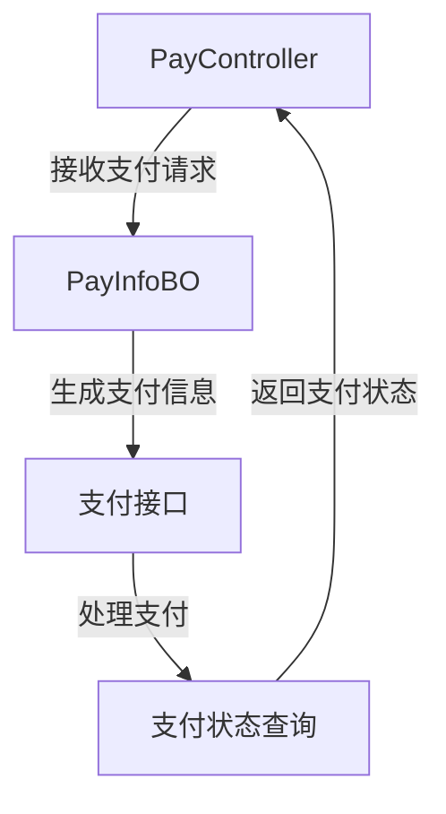
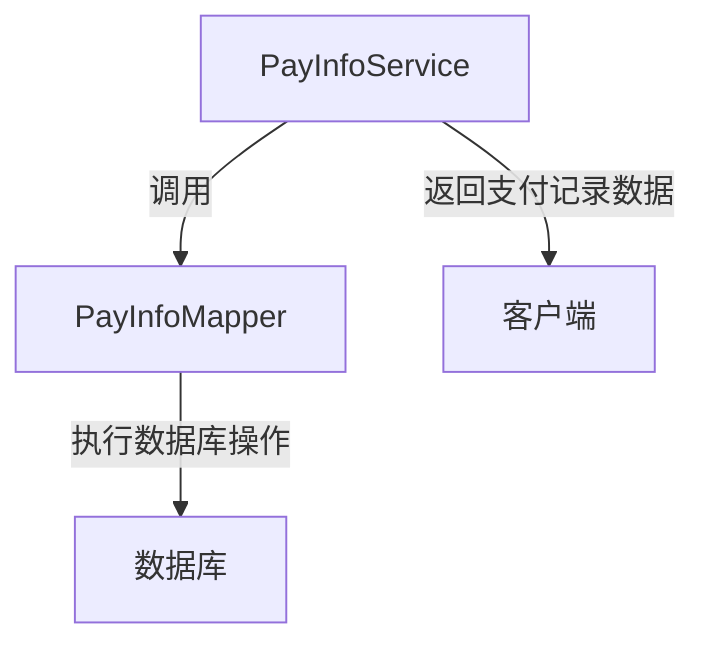
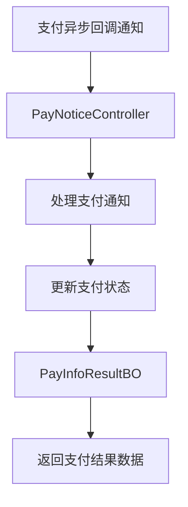
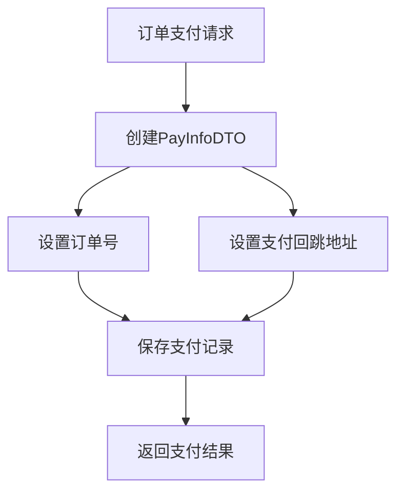

# mall4cloud-payment

## 项目总结
项目 mall4cloud-payment 包含以下主要模块：
- 处理订单支付记录的业务逻辑，包括支付、支付成功处理及支付状态查询。
- 该模块负责处理支付请求、管理支付状态及定义支付相关的业务数据。
- 该模块用于定义和管理订单支付记录的相关数据库操作。
- 处理支付异步回调通知并更新支付状态，定义支付后返回的基础数据对象。
- 定义订单支付记录的数据传输对象，包含订单号和支付回跳地址。

## 项目概览

[点击在浏览器中打开](repo_overview_with_communities.html)

## 主要模块
### 支付管理
处理订单支付记录的业务逻辑，包括支付、支付成功处理及支付状态查询。

### 支付处理
该模块负责处理支付请求、管理支付状态及定义支付相关的业务数据。

### 支付记录管理
该模块用于定义和管理订单支付记录的相关数据库操作。

### 支付回调处理
处理支付异步回调通知并更新支付状态，定义支付后返回的基础数据对象。

### 支付记录DTO
定义订单支付记录的数据传输对象，包含订单号和支付回跳地址。

