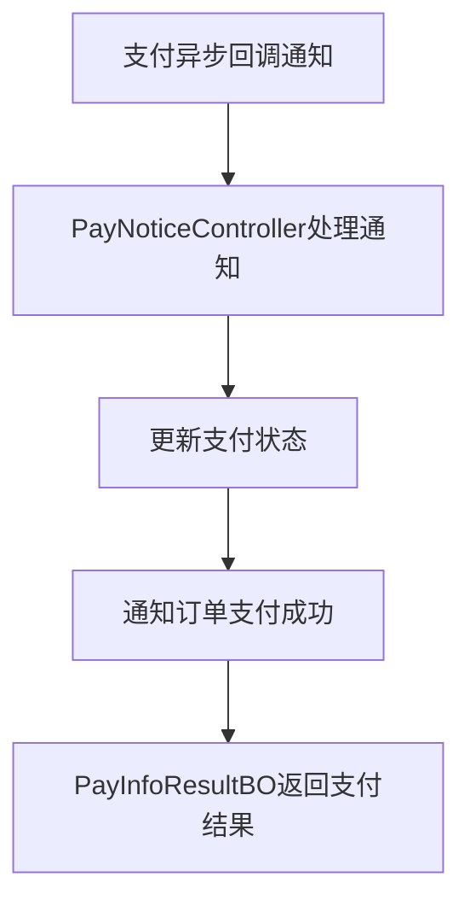
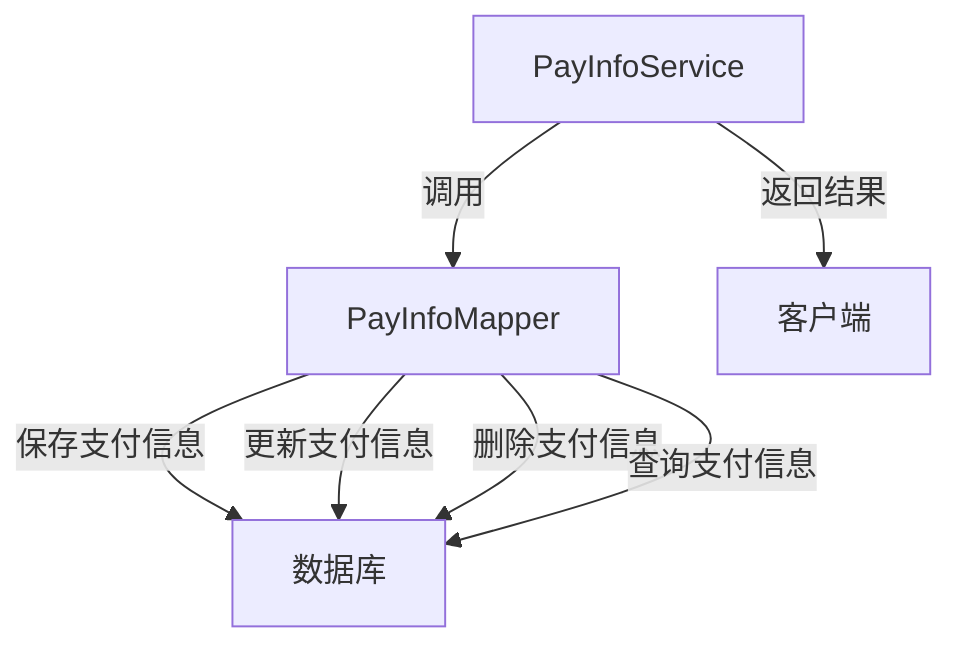
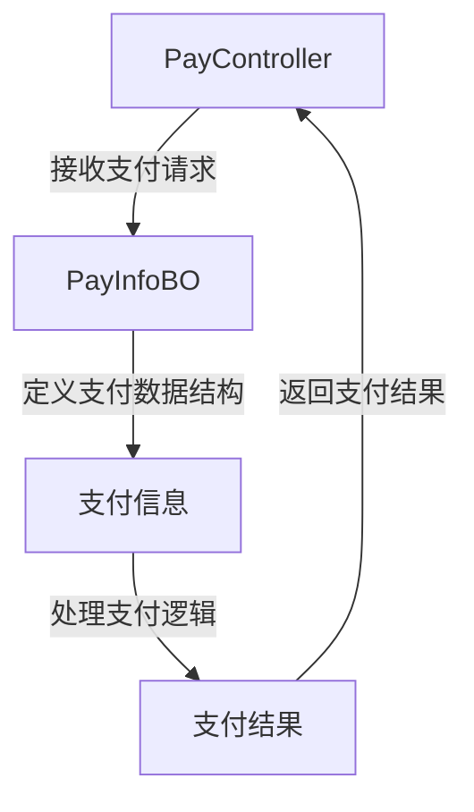
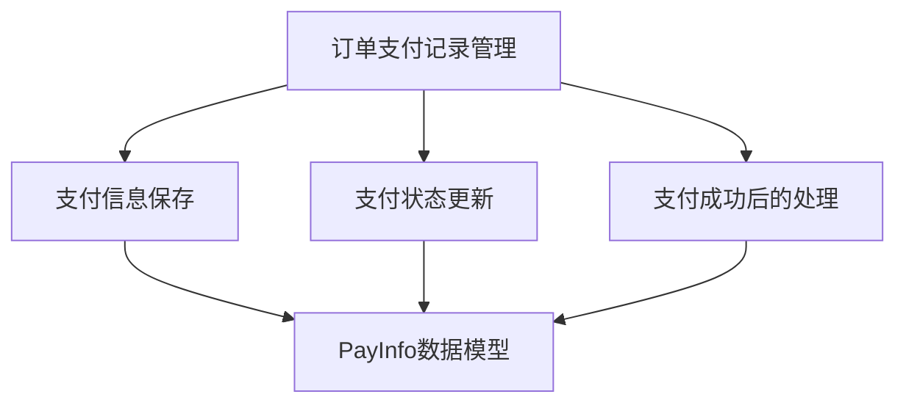
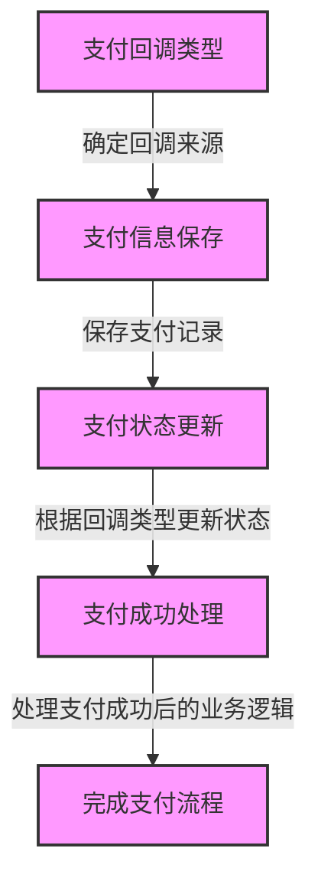
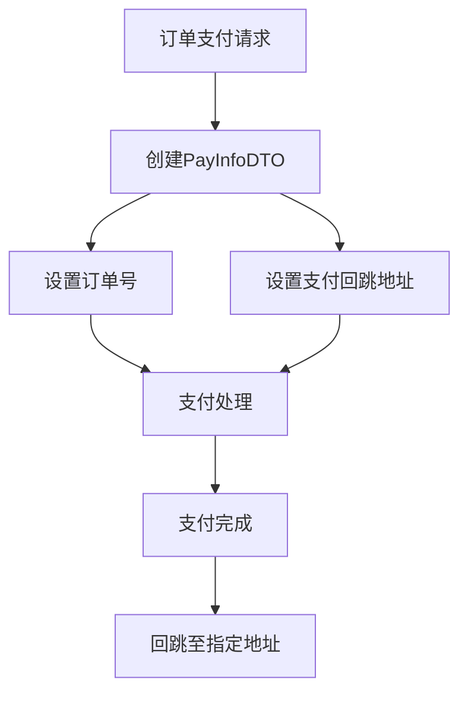

# mall4cloud-payment

## 项目总结
**项目名称：mall4cloud-payment**

**项目概述：**
mall4cloud-payment 是一个专注于支付管理的模块，主要用于处理与支付相关的各种操作，包括支付请求的处理、支付状态的更新、支付记录的保存与管理，以及支付成功后的通知处理。该模块的核心目标是确保支付流程的顺畅和支付数据的准确性，从而支持整个电商平台的订单支付功能。

**主要用途：**
1. **支付异步回调通知处理**：接收支付平台的异步回调通知，更新支付状态，并通知订单系统支付成功。
2. **支付记录管理**：负责支付记录的保存、更新、删除和查询操作，确保支付数据的完整性和可追溯性。
3. **支付请求处理**：处理用户发起的支付请求，定义支付数据结构，并管理相关的业务逻辑。
4. **支付成功处理**：在支付成功后，更新订单状态并执行后续的业务逻辑，如通知用户或更新库存。

**模块协同工作：**
- **支付请求处理模块**：接收用户的支付请求，定义支付数据结构，并调用支付平台进行支付操作。
- **支付记录管理模块**：在支付请求发起后，保存支付记录，并在支付状态更新时同步更新记录。
- **异步回调通知处理模块**：接收支付平台的异步回调通知，更新支付状态，并通知订单系统支付成功。
- **支付成功处理模块**：在支付成功后，执行后续的业务逻辑，如更新订单状态、通知用户等。

**数据传输对象（DTO）：**
- **订单支付记录DTO**：包含订单号和支付回跳地址，用于在支付流程中传递必要的信息。

通过这些模块的协同工作，mall4cloud-payment 确保了支付流程的高效、准确和可靠，为电商平台提供了强大的支付管理支持。

## 项目概览

[点击在浏览器中打开](repo_overview_with_communities.html)

## 主要模块
### 支付回调处理
该模块用于处理支付异步回调通知，更新支付状态并通知订单支付成功。

### 支付管理
该模块用于处理订单支付记录的保存、更新、删除和查询操作。

### 支付处理
该模块负责处理支付请求、定义支付数据结构并管理相关业务逻辑。

### 支付管理
该模块负责处理订单支付记录的管理，包括支付信息的保存、状态更新及支付成功后的处理。

### 支付记录DTO
定义订单支付记录的数据传输对象，包含订单号和支付回跳地址。

