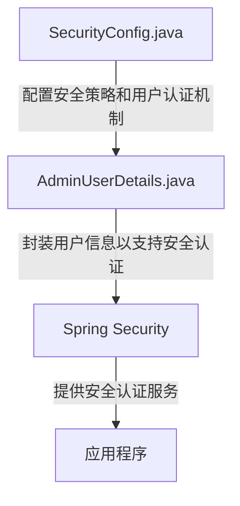
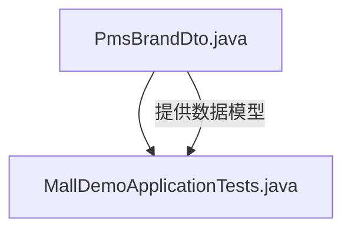
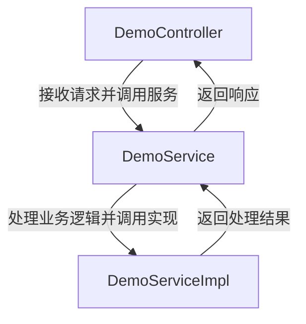
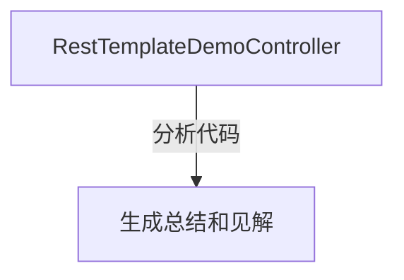
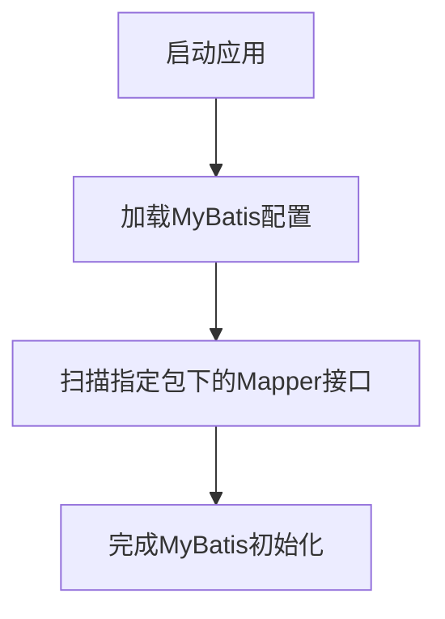

# mall-demo

## 项目总结
该项目是一个基于Spring Security和MyBatis的Java应用程序，主要用于品牌信息的管理和分析。以下是各模块的主要功能及其协同工作方式：

1. **安全认证模块**：负责配置和管理Spring Security的安全策略及用户认证机制，确保系统的安全性，防止未经授权的访问。

2. **品牌数据模型模块**：定义了品牌传递参数的数据模型，为品牌管理模块提供数据结构支持。

3. **品牌管理模块**：提供品牌信息的服务接口、控制器接口及其实现，用于管理品牌信息的增删改查等操作。该模块依赖于品牌数据模型模块来获取和操作品牌数据。

4. **代码分析器模块**：用于分析代码并提供简洁的总结和见解，帮助开发者理解代码结构和功能，提升代码质量。

5. **MyBatis配置模块**：配置MyBatis并扫描指定包下的Mapper接口，实现数据库操作的映射和管理，为品牌管理模块提供数据持久化支持。

**协同工作方式**：
- 安全认证模块保护整个系统的访问安全，确保只有经过认证的用户可以访问品牌管理模块。
- 品牌数据模型模块为品牌管理模块提供数据结构的定义，确保数据的一致性和完整性。
- 品牌管理模块通过MyBatis配置模块与数据库进行交互，实现品牌信息的持久化操作。
- 代码分析器模块独立运行，为开发者提供代码分析服务，帮助优化和维护代码。

通过这些模块的协同工作，项目实现了品牌信息的安全管理和高效操作，同时提供了代码分析功能，提升了开发效率。

## 项目概览

 [点击在浏览器中打开](repo_overview_with_communities.html)

## 主要模块
### 安全认证
配置和管理Spring Security的安全策略及用户认证机制。

### 品牌数据模型
定义品牌传递参数的数据模型。

### 品牌管理
该模块提供品牌信息的服务接口、控制器接口及其实现，用于管理品牌信息。

### 代码分析器
此模块用于分析代码并提供简洁的总结和见解。

### MyBatis配置
配置MyBatis并扫描指定包下的Mapper接口。

